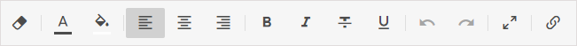

With RichText configuration options, you can make your work with text even more comfortable. It is possible to define the desired working mode and set the blocks of toolbar buttons you need in the order you want.

Working modes
---------------

There are two modes of RichText editor between which you can select to get the best working place for creating your perfect texts. The modes are:

- "classic"

- "document"

To specify the desired mode, you need to define it in the [mode](../api/properties.md#mode) option of the Richtext configuration object during initialization of the component:

~~~js
var richtext = new dhx.Richtext("richtext_container", {
	mode: "document"
});
~~~

**Related sample:** [Modes](https://snippet.dhtmlx.com/pdh5buvg)

Toolbar
------------

### Default toolbar

The RichText toolbar consists of several blocks of controls that can be changed according to your needs. By default, there are the following blocks of controls in the toolbar: 

- `"undo"` - to undo/redo recent actions
- `"style"` - to change the font, font size, turn plain text into a heading and vice versa, and make a quote out of the text
- `"decoration"` - to make text bold, italic, underlined or strike-through
- `"colors"` - to change the color of the text or its background
- `"align"` - to adjust the alignment of the text on a page
- `"link"` - to add a link into the text

The structure of toolbar is defined via the [toolbarBlocks](../api/properties.md#toolbarblocks) configuration option of the component, which is an array with strings presenting the names of controls.

~~~js
var richtext = new dhx.Richtext(document.body, {
	// default toolbar
    toolbarBlocks: [
    	"undo", "style", "decoration", "colors", 
        "align", "link"
    ]
});
~~~

**Related sample:** [Initialization](https://snippet.dhtmlx.com/32jtemtm)

You can add several more blocks to make the full toolbar: 

- `"clear"` - to clear formatting applied to the text
- `"fullscreen"` - to enter/exit the full screen mode
- `"stats"` - to display statistics about the text: the count of words, characters and characters excluding spaces or some custom statistical data
    
~~~js
var richtext = new dhx.Richtext(document.body, {
	// full toolbar
    toolbarBlocks: [
    	"undo", "style", "decoration", "colors", "align",
        "link", "clear", "stats", "fullscreen"
    ]
});
~~~

**Related sample:** [Full Toolbar](https://snippet.dhtmlx.com/5yga5ce1)

### Short toolbar definition

There is also a possibility to specify the default set of buttons via the `"default"` definition in the  `toolbarBlocks` array, like this:

~~~js
var richtext = new dhx.Richtext(document.body, {
	// full toolbar
    toolbarBlocks: ["default", "clear", "stats", "fullscreen"]
});
~~~

where the "default" string includes the default set of controls: `"undo"`, `"style"`, `"decoration"`, `"colors"`, `"align"` and `"link"`.

### Custom toolbar

You can specify your own structure of the toolbar by enumerating the necessary elements of the `toolbarBlocks` array in the desired order, for example:

~~~js
var richtext = new dhx.Richtext(document.body, {
	toolbarBlocks: ["clear", "colors", "align","decoration", 
    	"undo", "fullscreen","link"
    ]
});
~~~

**Related sample:** [Toolbar Blocks](https://snippet.dhtmlx.com/yp7en22d)

### Custom statistics in the toolbar 

The default statistics shown in the toolbar includes the following data about the text: the count of words, characters and characters excluding spaces.

But you can display any custom data via the [customStats](api/properties.md#customstats) configuration option. Set an array with necessary statistical parameters as a value of this option. 
Each parameter represents an object with two properties:

- `name` - (*string*) the name of the field that should be displayed
- `callback` - (*function*) a function that implements the logic of counting entries of the specified field

In the example below the editor shows the number of sentences together with the count of characters and words: 

~~~js
var richtext = new dhx.Richtext("richtext_container", {
	customStats: [
    	{
           name: "chars"
        },
        {
           name: "words"
        },
        {
           name: "sentences",
           cb: function(text) {
               var rawSentences = text.split(/[.?!]+/);
               var count = 0;
               for (var i=0; i<rawSentences.length; i++) {
                   if (rawSentences[i].length > 0) {
                       count += 1;
                   }
               }
               return count;
           }
        }
    ],
    toolbarBlocks: ["default", "stats"]
});
~~~

**Related sample:** [Custom Stats](https://snippet.dhtmlx.com/u1734epz)

Toolbar is [highly customizable](customization.md). You can add new controls, change the icons of controls and apply the desired icon pack. 

