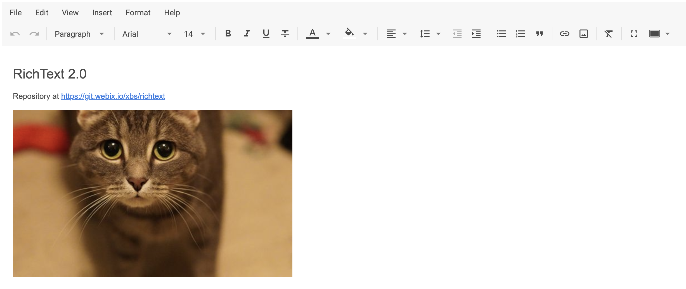

# Integration with Svelte

:::tip
You should be familiar with the basic concepts and patterns of **Svelte** before reading this documentation. To refresh your knowledge, please refer to the [**Svelte documentation**](https://svelte.dev/).
:::

DHTMLX RichText is compatible with **Svelte**. You can find code examples for using DHTMLX RichText with Svelte in the [**Example on GitHub**](https://github.com/DHTMLX/svelte-richtext-demo).

## Creating a project

:::info
Before you start to create a new project, install [**Vite**](https://vite.dev/) (optional) and [**Node.js**](https://nodejs.org/en/).
:::

There are several ways of creating a **Svelte** project:

- you can use the [**SvelteKit**](https://kit.svelte.dev/)

or

- you can also use **Svelte with Vite** (but without SvelteKit):

~~~json
npm create vite@latest
~~~

Check the details in the [related article](https://svelte.dev/docs/introduction#start-a-new-project-alternatives-to-sveltekit).

### Install dependencies

Name the project **my-svelte-richtext-app** and go to the app directory:

~~~json
cd my-svelte-richtext-app
~~~

Use a package manager to install dependencies and start the dev server:

- if you use [**yarn**](https://yarnpkg.com/), run the following commands:

~~~json
yarn
yarn start
~~~

- if you use [**npm**](https://www.npmjs.com/), run the following commands:

~~~json
npm install
npm run dev
~~~

The app runs on a localhost port, for example `http://localhost:3000`.

## Creating RichText

Get the DHTMLX RichText source code. Stop the app and install the RichText package.

### Step 1. Package installation

Download the [**trial RichText package**](/how_to_start/#installing-richtext-via-npm-or-yarn) and follow steps mentioned in the README file. Note that trial RichText is available 30 days only.

### Step 2. Component creation

Create a Svelte component to add RichText to the application. Create a new file in *src/* and name it *Richtext.svelte*.

#### Import source files

Open *Richtext.svelte* and import RichText source files. Note that:

- if you use PRO version and install the RichText package from a local folder, the import paths look like this:

~~~html title="Richtext.svelte"

~~~

- if you use the trial version of RichText, specify the following paths:

~~~html title="Richtext.svelte"

    

~~~

#### Load data

To add data to RichText, create a data set. Create *data.js* in *src/* and add the initial content:

~~~jsx {} title="data.ts"
export function getData() {
  const value = `
    <h2>RichText 2.0</h2>
    
Repository at <a href="https://git.webix.io/xbs/richtext">https://git.webix.io/xbs/richtext</a>

    

`;
  return { value };
}
~~~

Open *App.svelte*, import data, and pass it to the `<RichText/>` component as props:

~~~html {} title="App.svelte"

<RichText value={value} />
~~~

Open *Richtext.svelte* and apply the props to the RichText configuration object:

~~~html {} title="Richtext.svelte"

    

~~~

You can also use the [`setValue()`](/api/methods/set-value.md) method inside `onMount()` to load data into RichText:

~~~html {} title="Richtext.svelte"

    

~~~

The RichText component is ready to use. When the element is added to the page, it initializes RichText with data. You can also provide configuration settings — see the [RichText API docs](api/overview/main_overview.md) for the full list of available properties.

#### Handle events

When a user performs an action in RichText, it fires an event. Use these events to detect the action and run the desired code. See the [full list of events](api/overview/events_overview.md).

Open *Richtext.svelte* and update `onMount()`:

~~~html {} title="Richtext.svelte"

// ...
~~~

### Step 3. Add RichText to the app

To add the component to the app, open **App.svelte** and replace the default code:

~~~html title="App.svelte"

<RichText value={value}  />
~~~

Start the app to see RichText loaded with data on a page.

You know how to integrate DHTMLX RichText with Svelte. Customize the code according to your requirements. Find the final advanced example on [**GitHub**](https://github.com/DHTMLX/svelte-richtext-demo).
