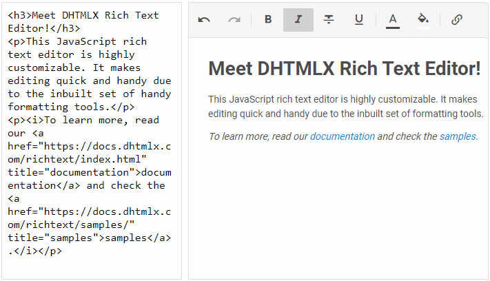
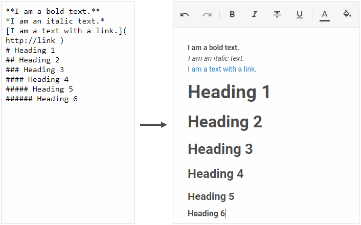
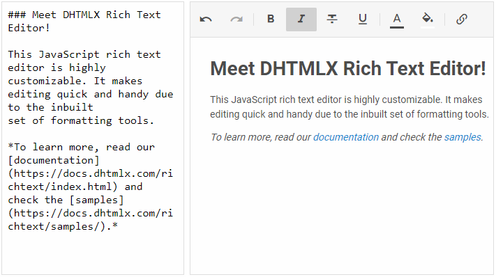

DHTMLX Richtext editor allows loading content in the HTML and Markdown formats. Thus, besides entering text right into the editor, you can load ready content in the supported format and edit it with the help of the RichText 
set of controls.

Format of content
------------------

### HTML format

Rich Text supports standard HTML format, so you can use all habitual formatting tags. The image below presents the result of parsing a text in the HTML format into the Rich Text editor:

### Markdown format

For parsing of a Markdown-formatted text, DHTMLX Richtext uses the [Marked.js](https://github.com/markedjs/marked) markdown parser.
For now the component supports basic formatting elements of the Markdown syntax. Check the cheat sheet below:

The following image demonstrates the result of parsing a text in the Markdown format into the Rich Text editor:

Adding content into editor
------------------

In order to add some text content into the RichText, make use of the [setValue()](api/methods.md#setvalue) method. The method takes two parameters:

- `value` - (*string*) a string with the content you want to add into the editor in either HTML or Markdown format
- `mode` - (*string*) optional, the format of text parsing: `"html"` (default) or `"markdown"`

Below you can find examples of loading text in both available formats:

- adding HTML content

~~~js
var htmlText = `<h1>Meet DHTMLX Rich Text Editor!</h1>` +
`
This demo will show you a customizable JavaScript rich text editor.
` +
`
<i>Read more in</i><a href="https://docs.dhtmlx.com"><i>documentation</i></a>
.`

richtext.setValue(htmlText);
~~~

**Related sample:** [Setting HTML content](https://snippet.dhtmlx.com/57v7n2kp)

- adding Markdown content

:::note
Note, that for a text in the Markdown format you need to define paragraphs by empty lines.
:::

~~~js
var mdText = `# Meet DHTMLX Rich Text Editor!

This demo will show you a customizable **JavaScript rich text editor**.

*To learn more, read [documentation](https://docs.dhtmlx.com/richtext/)*.`

richtext.setValue(mdText,"markdown");
~~~

**Related sample:** [Setting Markdown Value](https://snippet.dhtmlx.com/9jf91qn9)

