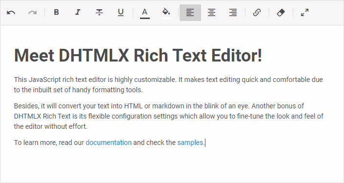

# How to start

RichText editor will make text editing quick and comfortable due to the inbuilt set of handy formatting tools.
Follow this comprehensive and easy-to-reproduce tutorial to create RichText editor on a page and start working with it.

## Step 1. Include source files

First create an HTML file with the name ***index.html***. Then include the source files of DHTMLX RichText into this file. [Take a look at the structure of RichText package](guides/initialization.md#including-source-files).

You need to include the following two files:

- the JS file of DHTMLX RichText
- the CSS file of DHTMLX RichText

~~~html title="index.html" {5-6}
<!DOCTYPE html>
<html>
    <head>
        <title>How to Start with DHTMLX RichText</title>
        
        <link rel="stylesheet" href="./codebase/richtext.css">
    </head>
    <body>
        
    </body>
</html>
~~~

### Installing RichText via npm or yarn

You can import JavaScript RichText into your project using `yarn` or `npm` package manager.

#### Installing trial RichText via npm or yarn

:::info
If you want to use trial version of RichText, download the [**trial RichText package**](https://dhtmlx.com/docs/products/dhtmlxRichtext/download.shtml) and follow steps mentioned in the *README* file. Note that trial RichText is available 30 days only.
:::

#### Installing PRO RichText via npm or yarn

:::info
You can access the DHTMLX private **npm** directly in the [Client's Area](https://dhtmlx.com/clients/) by generating your login and password for **npm**. A detailed installation guide is also available there. Please note that access to the private **npm** is available only while your proprietary RichText license is active.
:::

## Step 2. Create RichText

At this step you can add RichText on a page. There are two easy steps:

- Open the ***index.html*** file and create a DIV container in it.
- Initialize DHTMLX RichText in the container with the `richtext.Richtext` constructor. As the parameters of the constructor, pass the container you've created above and the configuration object of RichText as follows:

~~~html title="index.html"
<!DOCTYPE html>
<html>
    <head>
        <title>How to Start with DHTMLX RichText</title>
        
        <link rel="stylesheet" href="./codebase/richtext.css">
    </head>
    <body>
        

        
    </body>
</html>
~~~

## Step 3. Configuring RichText

Now it's time to define configuration properties to make the RichText meet you needs.

RichText includes several properties that let you adjust the Toolbar appearance and behavior as well as choose the most suitable mode of work with a document. [Learn all the available settings](api/properties.md).

For example, you can specify the **"document"** mode of RichText displaying:

~~~jsx
const rich = new richtext.Richtext("#root", {
    mode: "document"
});
~~~

There is a [detailed description of available RichText configuration settings](guides/configuration.md).

## Step 4. Set content (optional)

If necessary, you can parse some text in the HTML or Markdown format on the RichText initialization. Read more about this feature in the [related article](guides/loading_data.md).
