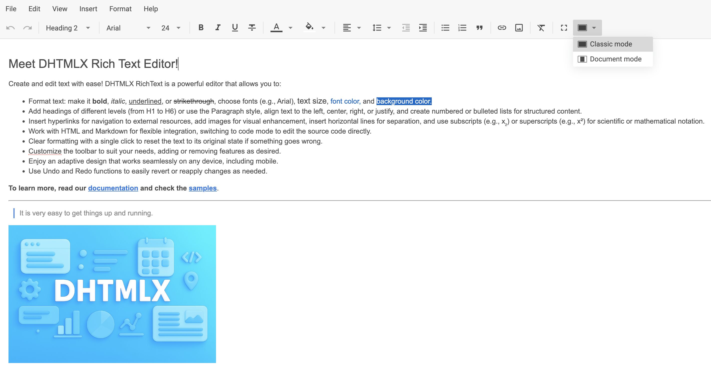

# How to start

This clear and comprehensive tutorial will guide your through the steps you need to take in order to get a fully functional RichText on a page.

## Step 1. Including source files

Start from creating an HTML file and call it *index.html*. Then proceed to include RichText source files into the created file.

There are two necessary files:

- the JS file of RichText
- the CSS file of RichText

~~~html {5-6} title="index.html"
<!DOCTYPE html>
<html>
    <head>
        <title>How to Start with RichText</title>
           
        <link href="./codebase/richtext.css" rel="stylesheet">
    </head>
    <body>
        
    </body>
</html>
~~~

### Installing RichText via npm or yarn

You can import JavaScript RichText into your project using **yarn** or **npm** package manager.

#### Installing trial RichText via npm or yarn

:::info
If you want to use trial version of RichText, download the [**trial RichText package**](https://dhtmlx.com/docs/products/dhtmlxRichtext/download.shtml) and follow steps mentioned in the *README* file. Note that trial RichText is available 30 days only.
:::

#### Installing PRO RichText via npm or yarn

:::info
You can access the DHTMLX private **npm** directly in the [Client's Area](https://dhtmlx.com/clients/) by generating your login and password for **npm**. A detailed installation guide is also available there. Please note that access to the private **npm** is available only while your proprietary RichText license is active.
:::

## Step 2. Creating RichText

Now you are ready to add RichText to the page. First, let's create the `
` container for RichText. So, take the following steps:

- specify a DIV container in the *index.html* file
- initialize RichText using the `richtext.Richtext` constructor

As parameters, the constructor takes any valid CSS selector of HTML container where the RichText will be placed into, as well as corresponding configuration objects.

~~~html {9,12-14} title="index.html"
<!DOCTYPE html>
<html>
    <head>
        <title>How to Start with RichText</title>
           
        <link href="./codebase/richtext.css" rel="stylesheet">  
    </head>
    <body>
        

        
    </body>
</html>
~~~

## Step 3. Configuring RichText

Next you can specify configuration properties you want the RichText component to have when initialized.

To start working with RichText, first you need to provide the initial data for editor via the [`value`](api/config/value.md) property. Beside this, you can enable [**menubar**](api/config/menubar.md), customize [**toolbar**](api/config/toolbar.md), specify [**fullscreen**](api/config/fullscreen-mode.md) and [**layout**](api/config/layout-mode.md) modes, apply new [**locale**](api/config/locale.md) as well as [**default styles**](api/config/default-styles.md).

~~~jsx {2-12}
const editor = new richtext.Richtext("#root", {
    menubar: true,
    toolbar: false,
    fullscreenMode: true,
    layoutMode: "document",
    locale: richtext.locales.cn
    defaultStyles: {
        h4: {
            "font-family": "Roboto"
        },
        // other settings
    }
});
~~~

## What's next

That's all. Just three simple steps and you have a handy tool for editing content. Now you can start working with your content or keep exploring the inner world of JavaScript RichText.
