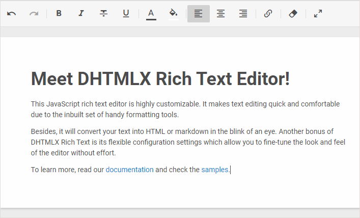

DHTMLX RichText is a JavaScript client-side tool for fast and handy editing of content. It provides a compact set of formatting controls, two editing modes for comfy work with text and an easily adjustable toolbar.

This component supports parsing and serialization of data in the HTML and JSON formats and allows using any icon fonts and adding custom controls. Besides, there are ready-made solutions for integration with
such popular JavaScript frameworks as Angular, React and Vue.js.

Toolbar structure
--------------------

The toolbar of Richtext is [easily configurable](guides/configuration.md#toolbar). It contains several blocks of controls and their number depends on the chosen type of toolbar:

- default toolbar
- full toolbar

The **default toolbar** includes 6 blocks of controls. They are: "undo", "style", "decoration", "colors", "align" and "link":

The **full toolbar** includes all the default blocks and additional "clear", "stats" and "fullscreen" blocks:

You can [adjust the look and feel of the toolbar](guides/customization.md) to meet your requirements.

Two working modes 
---------------------

DHTMLX Richtext can work with content in [two modes](guides/configuration.md). You can choose the most suitable mode to feel comfortable while editing text. The modes are:

- "classic"

- "document"

[Read more](guides/configuration.md#working-modes) about setting the mode you like best.

Supported formats
----------------

The RichText editor supports [parsing](guides/loading_data.md#adding-content-into-editor) and [serialization](guides/working_with_richtext.md#getting-content-from-editor) of content in the 
[HTML and Markdown formats](guides/loading_data.md#format-of-content).

- HTML format

- Markdown format

Integration
-------------

Rich Text can be integrated with other JavaScript frameworks. There are related guides and demos available for:

- [Integration with Angular](guides/angular_integration.md)
- [Integration with React](guides/react_integration.md)
- [Integration with Vue.js](guides/vuejs_integration.md)
