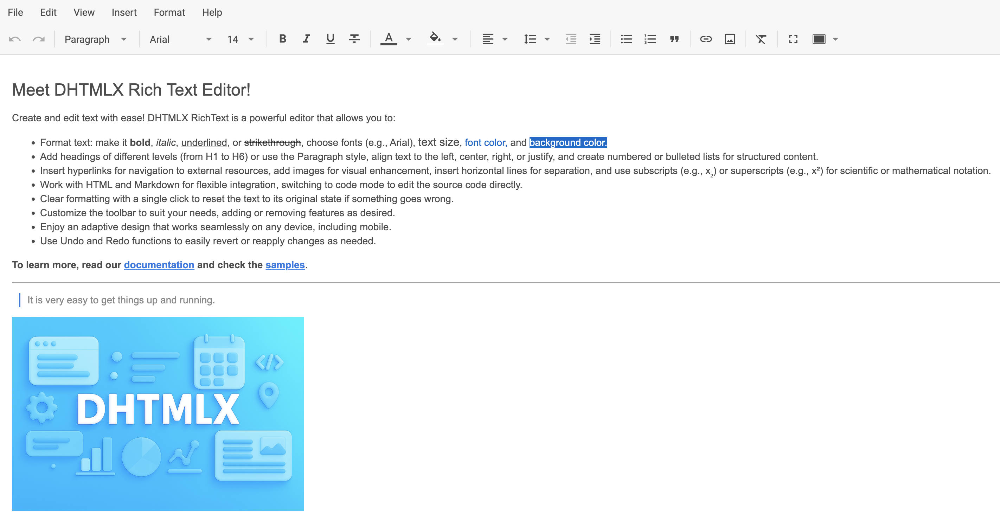

# Descripción general de RichText

**DHTMLX RichText** es un editor WYSIWYG flexible y liviano construido con JavaScript. Diseñado para ofrecer una experiencia de edición fluida en aplicaciones web modernas, RichText presenta una interfaz limpia, capacidades de formato enriquecido y control total sobre la representación del contenido. Ya sea que esté creando un CMS, una herramienta de administración interna o un editor de documentos integrado, RichText puede integrarse y personalizarse fácilmente para adaptarse a sus necesidades.

El componente **DHTMLX RichText** incluye las siguientes características:

- Dos [**modos de diseño**](api/config/layout-mode.md)

- Serialización de contenido a texto plano y HTML

- [**toolbar**](api/config/toolbar.md) configurable con botones integrados y personalizados

- [**Barra de menú**](api/config/menubar.md) estática que puede mostrarse u ocultarse

- Carga de imágenes, formato enriquecido, estilos personalizados y modo de pantalla completa

- [Acceso completo a la API](api/overview/main_overview.md) para el [manejo de eventos](api/overview/event_bus_methods_overview.md), la [manipulación de contenido](api/overview/methods_overview.md) y la [gestión reactiva del estado](api/overview/state_methods_overview.md)

RichText es independiente del framework y puede integrarse fácilmente con [React](guides/integration_with_react.md), [Angular](guides/integration_with_angular.md), [Vue](guides/integration_with_vue.md) y [Svelte](guides/integration_with_svelte.md), lo que lo hace adecuado para una amplia gama de ecosistemas front-end.

Esta documentación ofrece orientación detallada sobre instalación, configuración, uso y personalización. Encontrará ejemplos para escenarios comunes, [referencias completas de la API](api/overview/main_overview.md) y buenas prácticas para integrar RichText en su aplicación.

## Estructura de RichText {#richtext-structure}

### Barra de menú {#menubar}

La barra de menú de RichText proporciona acceso a acciones de edición como crear un nuevo documento, imprimir, importar/exportar contenido y más. Está oculta de forma predeterminada.

Use la propiedad [`menubar`](api/config/menubar.md) para alternar su visibilidad. Si bien la barra de menú puede habilitarse o deshabilitarse, su contenido no es configurable en este momento.

### Toolbar {#toolbar}

La toolbar de RichText proporciona acceso rápido a las funciones de formato de texto y edición estructural. De forma predeterminada, la [toolbar](api/config/toolbar.md#default-config) está habilitada y muestra un conjunto predefinido de controles de uso común, como negrita, cursiva, configuración de fuente, formato de lista y más.

La propiedad [`toolbar`](api/config/toolbar.md) le permite personalizar completamente el contenido y el diseño de la toolbar. Puede habilitar o deshabilitar la toolbar, reorganizar los controles predeterminados o definir una toolbar completamente personalizada mediante una matriz de identificadores de botones predefinidos y objetos de botones personalizados.

### Editor {#editor}

El editor de RichText es el área central donde los usuarios crean y dan formato al contenido. Puede controlar la apariencia y el comportamiento del editor mediante opciones de configuración como [`value`](api/config/value.md), [`layoutMode`](api/config/layout-mode.md) y [`defaultStyles`](api/config/default-styles.md). RichText también admite estilos personalizados, incrustación de imágenes y ajustes de diseño adaptable para satisfacer las necesidades de su aplicación.

#### Dos modos de trabajo {#two-working-modes}

DHTMLX RichText puede trabajar con contenido en los modos "classic" y "document". Puede elegir el modo más adecuado para sentirse cómodo al editar texto. Use la propiedad [`layoutMode`](api/config/layout-mode.md) para cambiar de modo mediante programación.

- **"classic"**

- **"document"**

## Formatos compatibles {#supported-formats}

El editor RichText admite el [análisis](api/methods/set-value.md) y la [serialización](api/methods/get-value.md) de contenido en los formatos **HTML** y texto plano.

#### Formato HTML {#html-format}

#### Formato de texto {#text-format}

## Atajos de teclado {#keyboard-shortcuts}

El editor RichText admite un conjunto de atajos de teclado comunes para un formato y edición más rápidos. Los atajos siguen las convenciones de cada plataforma y están disponibles tanto en **Windows/Linux** (`Ctrl`) como en **macOS** (`⌘`).

### Formato de texto {#text-formatting}

| Acción          | Windows/Linux   | macOS         |
|-----------------|-----------------|---------------|
| Negrita*        | `Ctrl+B`        | `⌘B`          |
| Cursiva         | `Ctrl+I`        | `⌘I`          |
| Subrayado       | `Ctrl+U`        | `⌘U`          |
| Tachado         | `Ctrl+Shift+X`  | `⌘⇧X`         |

### Edición {#editing}

| Acción   | Windows/Linux            | macOS         |
|----------|--------------------------|---------------|
| Deshacer | `Ctrl+Z`                 | `⌘Z`          |
| Rehacer  | `Ctrl+Y` / `Ctrl+Shift+Z`| `⌘Y` / `⌘⇧Z`  |
| Cortar   | `Ctrl+X`                 | `⌘X`          |
| Copiar   | `Ctrl+C`                 | `⌘C`          |
| Pegar    | `Ctrl+V`                 | `⌘V`          |

### Acciones especiales {#special-actions}

| Acción          | Windows/Linux | macOS |
|-----------------|---------------|-------|
| Insertar enlace | `Ctrl+K`      | `⌘K`  |
| Imprimir        | `Ctrl+P`      | `⌘P`  |

:::info[Información]
Es posible que se introduzcan más atajos en futuras actualizaciones.
:::

Para obtener la referencia actualizada de los atajos de teclado de RichText, presione **Help** y seleccione la opción **Keyboard shortcuts**:

