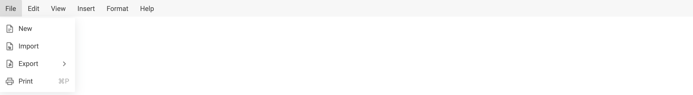
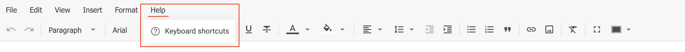

# RichText 개요

**DHTMLX RichText**는 JavaScript로 구축된 유연하고 경량의 WYSIWYG 에디터입니다. 현대 웹 애플리케이션에서 원활한 편집 경험을 제공하도록 설계된 RichText는 깔끔한 UI, 풍부한 서식 기능, 그리고 콘텐츠 렌더링에 대한 완전한 제어를 제공합니다. CMS, 내부 관리 도구, 또는 임베디드 문서 에디터를 구축하는 경우 모두, RichText는 필요에 맞게 쉽게 통합하고 커스터마이징할 수 있습니다.

**DHTMLX RichText** 컴포넌트에는 다음 기능이 포함됩니다:

- 두 가지 [**레이아웃 모드**](api/config/layout-mode.md)

- 일반 텍스트 및 HTML 형식의 콘텐츠 직렬화

- 기본 제공 버튼 및 커스텀 버튼을 포함한 구성 가능한 [**툴바**](api/config/toolbar.md)

- 표시하거나 숨길 수 있는 정적 [**메뉴바**](api/config/menubar.md)

- 이미지 업로드, 풍부한 서식, 커스텀 스타일, 전체 화면 모드

- [이벤트 처리](api/overview/event_bus_methods_overview.md), [콘텐츠 조작](api/overview/methods_overview.md), [반응형 상태 관리](api/overview/state_methods_overview.md)를 위한 [전체 API 접근](api/overview/main_overview.md)

RichText는 프레임워크에 구애받지 않으며 [React](guides/integration_with_react.md), [Angular](guides/integration_with_angular.md), [Vue](guides/integration_with_vue.md), [Svelte](guides/integration_with_svelte.md) 프레임워크와 쉽게 통합할 수 있어 다양한 프론트엔드 생태계에 적합합니다.

이 문서는 설치, 구성, 사용 및 커스터마이징에 대한 상세한 안내를 제공합니다. 일반적인 시나리오에 대한 예제, [전체 API 참조](api/overview/main_overview.md), 그리고 RichText를 애플리케이션에 임베드하기 위한 모범 사례를 찾아보실 수 있습니다.

## RichText 구조 {#richtext-structure}

### 메뉴바 {#menubar}

RichText 메뉴바는 새 문서 작성, 인쇄, 콘텐츠 가져오기/내보내기 등의 편집 작업에 접근할 수 있게 합니다. 기본적으로 숨겨져 있습니다.

[`menubar`](api/config/menubar.md) 속성을 사용하여 표시 여부를 전환하십시오. 메뉴바는 활성화 또는 비활성화할 수 있지만, 현재 시점에서 내용은 구성할 수 없습니다.

### 툴바 {#toolbar}

RichText 툴바는 텍스트 서식 및 구조적 편집 기능에 빠르게 접근할 수 있게 합니다. 기본적으로 [툴바](api/config/toolbar.md#default-config)가 활성화되어 있으며 굵게, 기울임꼴, 글꼴 설정, 목록 서식 등 일반적으로 사용되는 컨트롤의 사전 정의된 세트가 표시됩니다.

[`toolbar`](api/config/toolbar.md) 속성을 통해 툴바의 내용과 레이아웃을 완전히 커스터마이징할 수 있습니다. 툴바를 활성화 또는 비활성화하거나, 기본 컨트롤을 재배열하거나, 사전 정의된 버튼 식별자 배열과 커스텀 버튼 객체를 사용하여 완전히 커스텀 툴바를 정의할 수 있습니다.

### 에디터 {#editor}

RichText 에디터는 사용자가 콘텐츠를 작성하고 서식을 지정하는 중앙 영역입니다. [`value`](api/config/value.md), [`layoutMode`](api/config/layout-mode.md), [`defaultStyles`](api/config/default-styles.md)와 같은 구성 옵션을 통해 에디터의 외관과 동작을 제어할 수 있습니다. RichText는 또한 커스텀 스타일링, 이미지 임베딩, 그리고 애플리케이션 요구에 맞는 반응형 레이아웃 조정을 지원합니다.

#### 두 가지 작동 모드 {#two-working-modes}

DHTMLX RichText는 "classic" 및 "document" 모드로 콘텐츠를 다룰 수 있습니다. 텍스트를 편집할 때 가장 편안한 모드를 선택할 수 있습니다. [`layoutMode`](api/config/layout-mode.md) 속성을 사용하여 프로그래밍 방식으로 모드를 전환하십시오.

- **"classic"**

- **"document"**

## 지원 형식 {#supported-formats}

RichText 에디터는 **HTML** 및 일반 텍스트 형식의 콘텐츠 [파싱](api/methods/set-value.md)과 [직렬화](api/methods/get-value.md)를 지원합니다.

#### HTML 형식 {#html-format}

#### 텍스트 형식 {#text-format}

## 키보드 단축키 {#keyboard-shortcuts}

RichText 에디터는 빠른 서식 지정 및 편집을 위한 일반적인 키보드 단축키 세트를 지원합니다. 단축키는 플랫폼 규약을 따르며 **Windows/Linux** (`Ctrl`)와 **macOS** (`⌘`) 모두에서 사용할 수 있습니다.

### 텍스트 서식 {#text-formatting}

| 작업            | Windows/Linux   | macOS         |
|-----------------|-----------------|---------------|
| 굵게*           | `Ctrl+B`        | `⌘B`          |
| 기울임꼴        | `Ctrl+I`        | `⌘I`          |
| 밑줄            | `Ctrl+U`        | `⌘U`          |
| 취소선          | `Ctrl+Shift+X`  | `⌘⇧X`         |

### 편집 {#editing}

| 작업     | Windows/Linux            | macOS         |
|----------|--------------------------|---------------|
| 실행 취소 | `Ctrl+Z`                | `⌘Z`          |
| 다시 실행 | `Ctrl+Y` / `Ctrl+Shift+Z`| `⌘Y` / `⌘⇧Z`  |
| 잘라내기  | `Ctrl+X`                | `⌘X`          |
| 복사      | `Ctrl+C`                | `⌘C`          |
| 붙여넣기  | `Ctrl+V`                | `⌘V`          |

### 특수 작업 {#special-actions}

| 작업         | Windows/Linux | macOS |
|--------------|---------------|-------|
| 링크 삽입    | `Ctrl+K`      | `⌘K`  |
| 인쇄         | `Ctrl+P`      | `⌘P`  |

:::info[정보]
향후 업데이트에서 더 많은 단축키가 추가될 수 있습니다.
:::

RichText 키보드 단축키에 대한 최신 참조를 확인하려면 **도움말**을 누르고 **키보드 단축키** 옵션을 선택하십시오:

