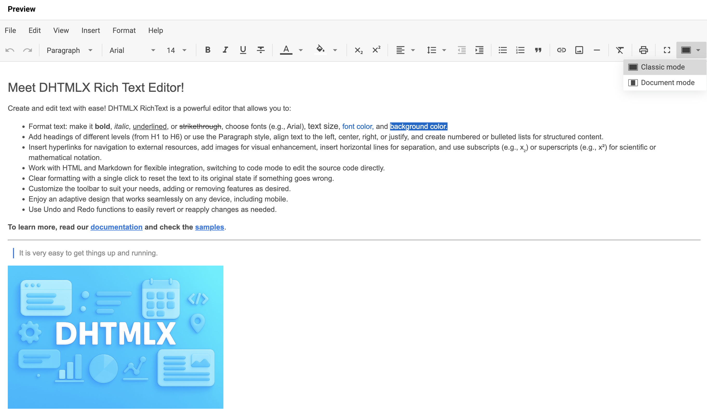

# Начало работы {#how-to-start}

Это понятное и исчерпывающее руководство проведёт вас через шаги, необходимые для того, чтобы получить полностью рабочий RichText на странице.

## Шаг 1. Подключение исходных файлов {#step-1-including-source-files}

Начните с создания HTML-файла и назовите его *index.html*. Затем подключите исходные файлы RichText в созданный файл.

Необходимы два файла:

- JS-файл RichText
- CSS-файл RichText

~~~html {5-6} title="index.html"
<!DOCTYPE html>
<html>
    <head>
        <title>How to Start with RichText</title>
           
        <link href="./codebase/richtext.css" rel="stylesheet">
    </head>
    <body>
        
    </body>
</html>
~~~

### Установка RichText через npm или yarn {#installing-richtext-via-npm-or-yarn}

Вы можете импортировать JavaScript RichText в свой проект с помощью пакетного менеджера **yarn** или **npm**.

#### Установка ознакомительной версии RichText через npm или yarn {#installing-trial-richtext-via-npm-or-yarn}

:::info[Информация]
Если вы хотите использовать ознакомительную версию RichText, загрузите [**пакет ознакомительной версии RichText**](https://dhtmlx.com/docs/products/dhtmlxRichtext/download.shtml) и следуйте инструкциям в файле *README*. Обратите внимание, что ознакомительная версия RichText доступна только 30 дней.
:::

#### Установка PRO-версии RichText через npm или yarn {#installing-pro-richtext-via-npm-or-yarn}

:::info[Информация]
Вы можете получить доступ к приватному **npm** DHTMLX напрямую в [Личном кабинете](https://dhtmlx.com/clients/), сгенерировав логин и пароль для **npm**. Подробное руководство по установке также доступно там. Обратите внимание, что доступ к приватному **npm** предоставляется только при наличии действующей лицензии на RichText.
:::

## Шаг 2. Создание RichText {#step-2-creating-richtext}

Теперь вы готовы добавить RichText на страницу. Сначала создадим контейнер `
` для RichText. Выполните следующие шаги:

- укажите DIV-контейнер в файле *index.html*
- инициализируйте RichText с помощью конструктора `richtext.Richtext`

В качестве параметров конструктор принимает любой валидный CSS-селектор HTML-контейнера, в который будет помещён RichText, а также соответствующие объекты конфигурации.

~~~html {9,12-14} title="index.html"
<!DOCTYPE html>
<html>
    <head>
        <title>How to Start with RichText</title>
           
        <link href="./codebase/richtext.css" rel="stylesheet">  
    </head>
    <body>
        

        
    </body>
</html>
~~~

## Шаг 3. Настройка RichText {#step-3-configuring-richtext}

Далее вы можете указать свойства конфигурации, которые должен иметь компонент RichText при инициализации.

Чтобы начать работу с RichText, сначала нужно передать начальные данные в редактор через свойство [`value`](api/config/value.md). Кроме того, вы можете включить [**menubar**](api/config/menubar.md), настроить [**toolbar**](api/config/toolbar.md), указать режимы [**fullscreen**](api/config/fullscreen-mode.md) и [**layout**](api/config/layout-mode.md), применить новую [**локаль**](api/config/locale.md), а также [**стили по умолчанию**](api/config/default-styles.md).

~~~jsx {2-12}
const editor = new richtext.Richtext("#root", {
    menubar: true,
    toolbar: false,
    fullscreenMode: true,
    layoutMode: "document",
    locale: richtext.locales.cn
    defaultStyles: {
        h4: {
            "font-family": "Roboto"
        },
        // другие настройки
    }
});
~~~

## Что дальше {#whats-next}

Вот и всё. Всего три простых шага — и у вас есть удобный инструмент для редактирования контента. Теперь вы можете начать работать с контентом или продолжить изучение возможностей JavaScript RichText.
