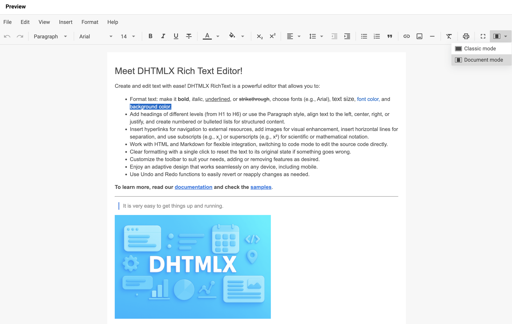

# 配置

您可以通过以下属性配置 RichText 的外观和行为：

- [`menubar`](api/config/menubar.md) — 显示或隐藏顶部菜单栏
- [`toolbar`](api/config/toolbar.md) — 配置工具栏的可见性和按钮
- [`fullscreenMode`](api/config/fullscreen-mode.md) — 以全屏模式启动编辑器
- [`layoutMode`](api/config/layout-mode.md) — 在 `"classic"` 和 `"document"` 布局之间切换
- [`value`](api/config/value.md) — 设置初始 HTML 内容
- [`locale`](api/config/locale.md) — 在初始化时应用本地化对象
- [`defaultStyles`](api/config/default-styles.md) — 为特定块类型设置默认样式
- [`imageUploadUrl`](api/config/image-upload-url.md) — 设置图片上传的端点

## 布局模式

RichText 支持两种编辑区域的布局模式：

- **"classic"** — 编辑区域填充整个页面

<div className="img_border">

</div>

- **"document"** — 编辑区域模拟文档页面

<div className="img_border">

</div>

在初始化时设置 [`layoutMode`](api/config/layout-mode.md) 属性以选择模式：

~~~jsx
const editor = new richtext.Richtext("#root", {
    layoutMode: "document"
});
~~~

## 工具栏

RichText 工具栏将控件分组为若干块，您可以对其进行自定义。

### 默认工具栏控件

您可以在 RichText 工具栏中包含以下按钮和控件：

| 按钮                | 描述                                                                        |
|---------------------|-----------------------------------------------------------------------------|
| `undo`              | 撤销最近的用户操作                                                          |
| `redo`              | 重做之前撤销的操作                                                          |
| `style`             | 选择文本样式（例如标题、段落、引用块）                                      |
| `font-family`       | 更改所选文本的字体                                                          |
| `font-size`         | 调整所选文本的大小                                                          |
| `bold`              | 对所选文本应用粗体格式                                                      |
| `italic`            | 对所选文本应用斜体格式                                                      |
| `underline`         | 为所选文本添加下划线                                                        |
| `strike`            | 对所选文本应用删除线格式                                                    |
| `subscript`         | 将文本格式设置为下标                                                        |
| `superscript`       | 将文本格式设置为上标                                                        |
| `text-color`        | 更改文本颜色                                                                |
| `background-color`  | 更改文本的背景（高亮）颜色                                                  |
| `align`             | 设置文本对齐方式（左对齐、居中、右对齐、两端对齐）                          |
| `indent`            | 增加段落缩进                                                                |
| `outdent`           | 减少段落缩进                                                                |
| `line-height`       | 调整行间距（行高）                                                          |
| `quote`             | 将文本格式设置为引用块                                                      |
| `bulleted-list`     | 创建无序列表                                                                |
| `numbered-list`     | 创建有序列表                                                                |
| `link`              | 插入或编辑超链接                                                            |
| `image`             | 插入图片                                                                    |
| `line`              | 插入水平分隔线                                                              |
| `clear`             | 清除所选文本的所有格式                                                      |
| `print`             | 打开打印对话框                                                              |
| `fullscreen`        | 切换全屏模式                                                                |
| `mode`              | 在两种布局模式之间切换：`classic` 和 `document`                             |
| `shortcuts`         | 显示可用键盘快捷键列表                                                      |
| `separator`         | 在控件之间添加视觉分隔符                                                    |

使用 [`toolbar`](api/config/toolbar.md) 属性将工具栏定义为控件名称字符串数组：

~~~jsx {2-36}
new richtext.Richtext("#root", {
    toolbar: [
        "undo",
        "redo",
        "separator",
        "style",
        "separator",
        "font-family",
        "font-size",
        "separator",
        "bold",
        "italic",
        "underline",
        "strike",
        "separator",
        "text-color",
        "background-color",
        "separator",
        "align",
        "line-height",
        "outdent",
        "indent",
        "separator",
        "bulleted-list",
        "numbered-list",
        "quote",
        "separator",
        "link",
        "image",
        "separator",
        "clear",
        "separator",
        "fullscreen",
        "mode"
        // other buttons
    ],
    // other configuration properties
});
~~~

**相关示例：** [RichText. Custom control and simplified toolbar](https://snippet.dhtmlx.com/wda202ih?tag=richtext)

### 添加自定义工具栏控件

向 [`toolbar`](api/config/toolbar.md) 数组传入一个对象，并设置以下字段之一：

- `type: string` — 必填。控件类型：`"button"`、`"richselect"` 或 `"colorpicker"`
- `id: string` — 可选。自定义控件 ID；不能与现有控件 ID 重复
- `icon: string` — 可选。图标类名；与标签组合使用
- `label: string` — 可选。按钮标签；与图标组合使用
- `tooltip: string` — 可选。鼠标悬停时显示的提示文本；若未设置则默认使用 `label`
- `css: string` — 可选。控件的 CSS 类。内置类：`wx-primary`、`wx-secondary`
- `handler: () => void` — 可选。点击时执行的 callback

以下示例结合了内置按钮、预定义的 `richselect` 类型控件以及两个自定义按钮：

~~~jsx {6-32}
new richtext.Richtext("#root", {
    toolbar: [
        // string entries represent built-in buttons
        "bold",
        "italic",
        // predefined buttons accept only { type: "button", id: string }
        {
            type: "button",
            id: "fullscreen",
        },
        // for predefined richselect/colorpicker controls, set the matching type
        // entries with a non-matching type are ignored
        {
            type: "richselect", // type: "button" would be ignored here
            id: "mode",
        },
        // custom buttons (richselect/colorpicker are not supported for custom controls)
        {
            type: "button",
            id: "some",
            label: "Some",
            handler: () => {/* custom logic */}
        },
        {
            type: "button",
            id: "other",
            icon: "wxo-help",
            label: "Other",
            tooltip: "Some tooltip",
            handler: () => {/* custom logic */}
        }
    ],
    // other configuration properties
});
~~~

**相关示例：** [RichText. Custom control and simplified toolbar](https://snippet.dhtmlx.com/wda202ih?tag=richtext)

### 隐藏工具栏

将 [`toolbar`](api/config/toolbar.md) 属性设置为 `false` 以隐藏工具栏：

~~~jsx {2}
new richtext.Richtext("#root", {
    toolbar: false,
    // other configuration properties
});
~~~

## 显示菜单栏

启用 [`menubar`](api/config/menubar.md) 属性，可在工具栏上方渲染顶部菜单栏。默认值为 `false`。

~~~jsx {2}
new richtext.Richtext("#root", {
    menubar: true
    // other configuration properties
});
~~~

## 设置初始内容

使用 [`value`](api/config/value.md) 属性在初始化时向编辑器传入初始 HTML 内容：

~~~jsx {2}
new richtext.Richtext("#root", {
    value: "<h1>some value</h1>"
    // other configuration properties
});
~~~

若需要在初始化后替换内容，或使用自定义编码器以非 HTML 格式加载内容，请调用 [`setValue()`](api/methods/set-value.md) 方法。

## 设置初始语言环境

使用 [`locale`](api/config/locale.md) 属性在初始化时应用本地化对象：

~~~jsx {2}
new richtext.Richtext("#root", {
    locale: richtext.locales.cn
    // other configuration properties
});
~~~

有关详细信息以及使用 [`setLocale()`](api/methods/set-locale.md) 动态切换语言环境，请参阅[本地化](guides/localization.md)指南。

## 以全屏模式启动

将 [`fullscreenMode`](api/config/fullscreen-mode.md) 属性设置为 `true`，可在初始化时以全屏模式打开编辑器。默认值为 `false`。

~~~jsx {2}
new richtext.Richtext("#root", {
    fullscreenMode: true
    // other configuration properties
});
~~~

## 配置图片上传 URL

向 [`imageUploadUrl`](api/config/image-upload-url.md) 属性传入 URL，以设置工具栏图片上传的服务端端点：

~~~jsx {2}
new richtext.Richtext("#root", {
    imageUploadUrl: "https://example.com/upload"
    // other configuration properties
});
~~~

## 配置默认样式

使用 [`defaultStyles`](api/config/default-styles.md) 属性为各块类型设置默认样式。

[`defaultStyles`](api/config/default-styles.md) 属性的类型签名如下：

~~~jsx {}
defaultStyles?: boolean | {
    "*"?: { // applies to all blocks; sets common properties for every block
        "font-family"?: string; // "Roboto"| "Arial" | "Georgia" | "Tahoma" | "Times New Roman" | "Verdana"
        "font-size"?: string; // "12px" | "14px" | "16px" | "18px" | "20px" | "24px" | "28px" | "32px" | "36px"
        color?: string;
        background?: string;
    },
    p?: {
        "font-family"?: string; // "Roboto"| "Arial" | "Georgia" | "Tahoma" | "Times New Roman" | "Verdana"
        "font-size"?: string; // "12px" | "14px" | "16px" | "18px" | "20px" | "24px" | "28px" | "32px" | "36px"
        color?: string;
        background?: string;
    },
    blockquote?: {
        "font-family"?: string; // "Roboto"| "Arial" | "Georgia" | "Tahoma" | "Times New Roman" | "Verdana"
        "font-size"?: string; // "12px" | "14px" | "16px" | "18px" | "20px" | "24px" | "28px" | "32px" | "36px"
        color?: string;
        background?: string;
    },
    h1?: {
        "font-family"?: string; // "Roboto"| "Arial" | "Georgia" | "Tahoma" | "Times New Roman" | "Verdana"
        "font-size"?: string; // "12px" | "14px" | "16px" | "18px" | "20px" | "24px" | "28px" | "32px" | "36px"
        color?: string;
        background?: string;
    },
    h2?: {
        "font-family"?: string; // "Roboto"| "Arial" | "Georgia" | "Tahoma" | "Times New Roman" | "Verdana"
        "font-size"?: string; // "12px" | "14px" | "16px" | "18px" | "20px" | "24px" | "28px" | "32px" | "36px"
        color?: string;
        background?: string;
    },
    h3?: {
        "font-family"?: string; // "Roboto"| "Arial" | "Georgia" | "Tahoma" | "Times New Roman" | "Verdana"
        "font-size"?: string; // "12px" | "14px" | "16px" | "18px" | "20px" | "24px" | "28px" | "32px" | "36px"
        color?: string;
        background?: string;
    },
    h4?: {
        "font-family"?: string; // "Roboto"| "Arial" | "Georgia" | "Tahoma" | "Times New Roman" | "Verdana"
        "font-size"?: string; // "12px" | "14px" | "16px" | "18px" | "20px" | "24px" | "28px" | "32px" | "36px"
        color?: string;
        background?: string;
    },
    h5?: {
        "font-family"?: string; // "Roboto"| "Arial" | "Georgia" | "Tahoma" | "Times New Roman" | "Verdana"
        "font-size"?: string; // "12px" | "14px" | "16px" | "18px" | "20px" | "24px" | "28px" | "32px" | "36px"
        color?: string;
        background?: string;
    },
    h6?: {
        "font-family"?: string; // "Roboto"| "Arial" | "Georgia" | "Tahoma" | "Times New Roman" | "Verdana"
        "font-size"?: string; // "12px" | "14px" | "16px" | "18px" | "20px" | "24px" | "28px" | "32px" | "36px"
        color?: string;
        background?: string;
    }
};
~~~

[`defaultStyles`](api/config/default-styles.md) 属性不会直接将 CSS 应用于受影响的块，需另行应用匹配的 CSS 样式：

```html title="index.html"
<div id="root"></div>
```

```jsx {2-9} title="index.js"
const editor = new richtext.Richtext("#root", {
    defaultStyles: {
        h2: { 
            "font-family": "Roboto",
            "font-size": "28px",
            color: "purple",
            background: "#FFC0CB"
        }
    }
});
```

```css title="index.css"
#root h2 {
    font-family: Roboto;
    font-size: 28px;
    color: purple;
    background: #FFC0CB;
}
```

在此示例中，所有 `h2` 块均使用 `"Roboto"` 字体，字号为 28px，紫色文字，粉色背景。匹配的 CSS 规则将相同的值应用于渲染后的 `h2` 元素。

**相关示例：** [RichText. Changing the default value for typography (font, font size, etc.)](https://snippet.dhtmlx.com/6u3ti01s?tag=richtext)
