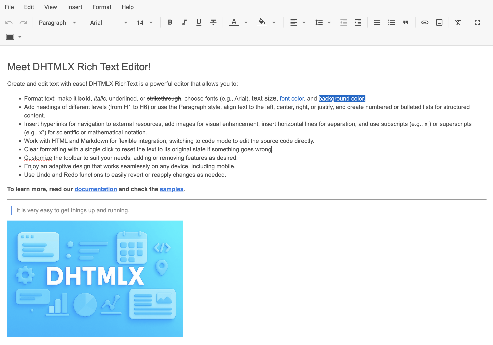

# 与 Angular 集成

:::tip
请确保您已熟悉 Angular 的基本概念和模式。如需复习，请参阅 [Angular 文档](https://v17.angular.io/docs)。
:::

DHTMLX RichText 支持与 Angular 配合使用。完整代码示例请参见 [GitHub 演示](https://github.com/DHTMLX/angular-richtext-demo)。

## 创建项目

:::info
在创建新项目之前，请先安装 [Angular CLI](https://v17.angular.io/cli) 和 [Node.js](https://nodejs.org/en/)。
:::

使用 Angular CLI 创建一个名为 *my-angular-richtext-app* 的新项目：

~~~bash
ng new my-angular-richtext-app
~~~

:::note
在项目创建过程中，当 Angular CLI 提示时，请禁用服务端渲染 (SSR) 和静态站点生成 (SSG/Prerendering)。
:::

该命令会安装所有必要的工具，无需执行其他命令。

### 安装依赖

切换到新应用目录：

~~~bash
cd my-angular-richtext-app
~~~

使用 [yarn](https://yarnpkg.com/) 包管理器安装依赖并启动开发服务器：

~~~bash
yarn
yarn start
~~~

应用将运行在本地（例如 `http://localhost:3000`）。

## 创建 RichText

停止应用并安装 RichText 包。

### 步骤 1. 安装包

下载 [RichText 试用包](/how_to_start/#installing-richtext-via-npm-or-yarn) 并按照 README 文件中的步骤操作。试用许可证有效期为 30 天。

### 步骤 2. 创建组件

创建一个 Angular 组件以将 RichText 添加到应用中。在 *src/app/* 目录下，创建 *richtext* 文件夹，并添加名为 *richtext.component.ts* 的新文件。

#### 导入源文件

打开 *richtext.component.ts* 并导入 RichText 源文件。

对于从本地文件夹安装的 PRO 版本，使用：

~~~jsx
import { Richtext } from 'dhx-richtext-package';
~~~

对于试用版本，使用：

~~~jsx
import { Richtext } from '@dhx/trial-richtext';
~~~

本教程使用 RichText 的试用版本。

#### 设置容器并初始化 RichText

为 RichText 设置容器元素，并在 `ngOnInit()` 中使用 `Richtext` 构造函数初始化组件。在 `ngOnDestroy()` 中调用 [`destructor()`](api/methods/destructor.md) 方法进行清理：

~~~jsx {} title="richtext.component.ts"
import { Richtext } from '@dhx/trial-richtext';
import { Component, ElementRef, OnInit, ViewChild, OnDestroy, ViewEncapsulation } from '@angular/core';

@Component({
    encapsulation: ViewEncapsulation.None,
    selector: "richtext", // use the "richtext" selector in app.component.ts as <richtext />
    styleUrls: ["./richtext.component.css"], // include the css file
    template:  `

                    

                
`
})

export class RichTextComponent implements OnInit, OnDestroy {
    // container for RichText
    @ViewChild("richtext_container", { static: true }) richtext_container!: ElementRef;

    private _editor!: Richtext;

    ngOnInit() {
        // initialize the RichText component
        this._editor = new Richtext(this.richtext_container.nativeElement, {});
    }

    ngOnDestroy(): void {
        this._editor.destructor(); // destroy RichText
    }
}
~~~

#### 添加样式

在 *src/app/richtext/* 目录下创建 *richtext.component.css* 文件，添加 RichText 及其容器的样式：

~~~css title="richtext.component.css"
/* import RichText styles */
@import "@dhx/trial-richtext/dist/richtext.css";

/* base page styles */
html,
body{
    height: 100%;
    padding: 0;
    margin: 0;
}

/* RichText container */
.component_container {
    height: 100%; 
    margin: 0 auto;
}

/* RichText widget */
.widget {
    height: calc(100% - 56px);
}
~~~

#### 加载数据

为 RichText 提供数据。在 *src/app/richtext/* 目录下创建 *data.ts* 文件：

~~~jsx {} title="data.ts"
export function getData() {
  const value = `
    <h2>RichText 2.0</h2>
    
Repository at <a href="https://git.webix.io/xbs/richtext">https://git.webix.io/xbs/richtext</a>

    

`;
  return { value };
}
~~~

打开 *richtext.component.ts*，导入数据并在 `ngOnInit()` 中将 `value` 属性传递给 RichText 配置：

~~~jsx {} title="richtext.component.ts"
import { Richtext } from '@dhx/trial-richtext';
import { getData } from "./data"; // import data
import { Component, ElementRef, OnInit, ViewChild, OnDestroy, ViewEncapsulation } from '@angular/core';

@Component({
    encapsulation: ViewEncapsulation.None,
    selector: "richtext", 
    styleUrls: ["./richtext.component.css"],
    template:  `

                    

                
`
})

export class RichTextComponent implements OnInit, OnDestroy {
    @ViewChild("richtext_container", { static: true }) richtext_container!: ElementRef;

    private _editor!: Richtext;

    ngOnInit() {
        const { value } = getData(); // extract the value from the data module
        this._editor = new Richtext(this.richtext_container.nativeElement, {
            value
            // other configuration properties 
        });
    }

    ngOnDestroy(): void {
        this._editor.destructor(); 
    }
}
~~~

或者，在 `ngOnInit()` 中调用 [`setValue()`](api/methods/set-value.md) 方法将数据加载到 RichText 中：

~~~jsx {} title="richtext.component.ts"
import { Richtext } from '@dhx/trial-richtext';
import { getData } from "./data"; // import data
import { Component, ElementRef, OnInit, ViewChild, OnDestroy, ViewEncapsulation } from '@angular/core';

@Component({
    encapsulation: ViewEncapsulation.None,
    selector: "richtext", 
    styleUrls: ["./richtext.component.css"],
    template:  `

                    

                
`
})

export class RichTextComponent implements OnInit, OnDestroy {
    @ViewChild("richtext_container", { static: true }) richtext_container!: ElementRef;

    private _editor!: Richtext;

    ngOnInit() {
        const { value } = getData(); // extract the value from the data module
        this._editor = new Richtext(this.richtext_container.nativeElement, {
            // other configuration properties 
        });

        // apply the data via the setValue() method
        this._editor.setValue(value); 
    }

    ngOnDestroy(): void {
        this._editor.destructor(); 
    }
}
~~~

RichText 组件已准备就绪。当 `<richtext/>` 元素挂载时，Angular 会渲染带有数据的编辑器。完整的配置选项列表请参见 [RichText API 概览](api/overview/main_overview.md)。

#### 处理事件

RichText 会在用户操作时触发事件。使用 [`api.on()`](api/internal/on.md) 方法订阅事件以响应用户输入。请参见[完整事件列表](api/overview/events_overview.md)。

打开 *richtext.component.ts* 并更新 `ngOnInit()` 方法。以下示例在每次触发 [`print`](api/events/print.md) 事件时记录一条消息：

~~~jsx {} title="richtext.component.ts"
// ...
ngOnInit() {
    this._editor = new Richtext(this.richtext_container.nativeElement, {});

    this._editor.api.on("print", () => {
        console.log("The document is printing");
    });
}

ngOnDestroy(): void {
    this._editor.destructor(); 
}
~~~

### 步骤 3. 将 RichText 添加到应用

打开 *src/app/app.component.ts*，将默认代码替换为 `<richtext/>` 选择器：

~~~jsx {} title="app.component.ts"
import { Component } from "@angular/core";

@Component({
    selector: "app-root",
    template: `<richtext/>`
})
export class AppComponent {
    name = "";
}
~~~

创建 *src/app/app.module.ts* 并声明 `RichTextComponent`：

~~~jsx {} title="app.module.ts"
import { NgModule } from "@angular/core";
import { BrowserModule } from "@angular/platform-browser";

import { AppComponent } from "./app.component";
import { RichTextComponent } from "./richtext/richtext.component";

@NgModule({
    declarations: [AppComponent, RichTextComponent],
    imports: [BrowserModule],
    bootstrap: [AppComponent]
})
export class AppModule {}
~~~

打开 *src/main.ts* 并将内容替换为引导代码：

~~~jsx title="main.ts"
import { platformBrowserDynamic } from "@angular/platform-browser-dynamic";
import { AppModule } from "./app/app.module";
platformBrowserDynamic()
    .bootstrapModule(AppModule)
    .catch((err) => console.error(err));
~~~

启动应用，查看 RichText 在页面上渲染并显示数据。

您现在已在 Angular 中完成了 RichText 的集成。可根据需要自定义代码。完整示例可在 [GitHub](https://github.com/DHTMLX/angular-richtext-demo) 上获取。
