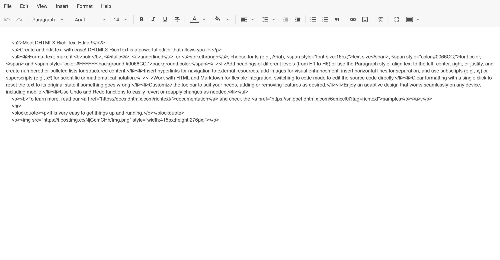

# RichText 概览

**DHTMLX RichText** 是一款基于 JavaScript 构建的灵活、轻量级所见即所得（WYSIWYG）编辑器。它专为现代 Web 应用提供流畅的编辑体验，具备简洁的 UI、丰富的格式化功能以及对内容渲染的完全控制。无论您正在构建 CMS、内部管理工具还是嵌入式文档编辑器，RichText 都可以轻松集成并按需定制。

**DHTMLX RichText** 组件包含以下功能：

- 两种[**布局模式**](api/config/layout-mode.md)

- 内容序列化为纯文本和 HTML 两种格式

- 可配置的[**工具栏（toolbar）**](api/config/toolbar.md)，支持内置按钮和自定义按钮

- 可显示或隐藏的静态[**菜单栏（menubar）**](api/config/menubar.md)

- 图片上传、富文本格式化、自定义样式和全屏模式

- 完整的 [API 访问](api/overview/main_overview.md)，支持[事件处理](api/overview/event_bus_methods_overview.md)、[内容操作](api/overview/methods_overview.md)和[响应式状态管理](api/overview/state_methods_overview.md)

RichText 与框架无关，可轻松与 [React](guides/integration_with_react.md)、[Angular](guides/integration_with_angular.md)、[Vue](guides/integration_with_vue.md) 和 [Svelte](guides/integration_with_svelte.md) 框架集成，适用于各种前端生态系统。

本文档提供了安装、配置、使用和定制的详细指导。您将找到常见场景的示例、[完整 API 参考](api/overview/main_overview.md)以及将 RichText 嵌入应用程序的最佳实践。

## RichText 结构 {#richtext-structure}

### 菜单栏（Menubar） {#menubar}

RichText 菜单栏（menubar）提供对编辑操作的访问，例如新建文档、打印、导入/导出内容等。默认情况下，菜单栏处于隐藏状态。

使用 [`menubar`](api/config/menubar.md) 属性可切换其可见性。菜单栏可以启用或禁用，但目前其内容不可配置。

### 工具栏（Toolbar） {#toolbar}

RichText 工具栏（toolbar）提供对文本格式化和结构编辑功能的快速访问。默认情况下，[工具栏](api/config/toolbar.md#default-config)已启用，并显示一组预定义的常用控件，如加粗、斜体、字体设置、列表格式化等。

[`toolbar`](api/config/toolbar.md) 属性允许您完全自定义工具栏的内容和布局。您可以启用或禁用工具栏、重新排列默认控件，或使用预定义按钮标识符数组和自定义按钮对象定义完全自定义的工具栏。

### 编辑区（Editor） {#editor}

RichText 编辑区是用户创建和格式化内容的核心区域。您可以通过 [`value`](api/config/value.md)、[`layoutMode`](api/config/layout-mode.md) 和 [`defaultStyles`](api/config/default-styles.md) 等配置选项控制编辑器的外观和行为。RichText 还支持自定义样式、图片嵌入和响应式布局调整，以满足应用程序的需求。

#### 两种工作模式 {#two-working-modes}

DHTMLX RichText 可在"classic"（经典）和"document"（文档）两种模式下处理内容。您可以选择最适合的模式以获得舒适的文本编辑体验。使用 [`layoutMode`](api/config/layout-mode.md) 属性可以通过程序切换模式。

- **"classic"（经典模式）**

- **"document"（文档模式）**

## 支持的格式 {#supported-formats}

RichText 编辑器支持 **HTML** 和纯文本格式的[解析](api/methods/set-value.md)和[序列化](api/methods/get-value.md)。

#### HTML 格式 {#html-format}

#### 文本格式 {#text-format}

## 键盘快捷键 {#keyboard-shortcuts}

RichText 编辑器支持一组常用键盘快捷键，以便更快速地进行格式化和编辑操作。快捷键遵循平台惯例，在 **Windows/Linux**（`Ctrl`）和 **macOS**（`⌘`）上均可使用。

### 文本格式化 {#text-formatting}

| 操作            | Windows/Linux   | macOS         |
|-----------------|-----------------|---------------|
| 加粗*           | `Ctrl+B`        | `⌘B`          |
| 斜体            | `Ctrl+I`        | `⌘I`          |
| 下划线           | `Ctrl+U`        | `⌘U`          |
| 删除线           | `Ctrl+Shift+X`  | `⌘⇧X`         |

### 编辑操作 {#editing}

| 操作     | Windows/Linux            | macOS         |
|----------|--------------------------|---------------|
| 撤销     | `Ctrl+Z`                 | `⌘Z`          |
| 重做     | `Ctrl+Y` / `Ctrl+Shift+Z`| `⌘Y` / `⌘⇧Z`  |
| 剪切     | `Ctrl+X`                 | `⌘X`          |
| 复制     | `Ctrl+C`                 | `⌘C`          |
| 粘贴     | `Ctrl+V`                 | `⌘V`          |

### 特殊操作 {#special-actions}

| 操作         | Windows/Linux | macOS |
|--------------|---------------|-------|
| 插入链接     | `Ctrl+K`      | `⌘K`  |
| 打印         | `Ctrl+P`      | `⌘P`  |

:::info[信息]
未来更新中可能会引入更多快捷键。
:::

要获取 RichText 键盘快捷键的实际参考，请按 **Help（帮助）** 并选择 **Keyboard shortcuts（键盘快捷键）** 选项：

